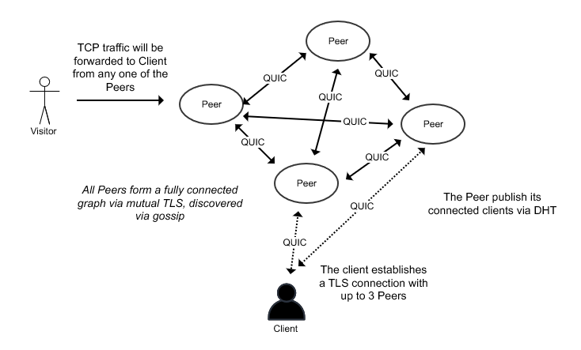

# Specter

This is the specification document for the Project 4 of CS682, codename `Specter`.

## What is it?

Specter aims to create a distributed network of nodes that forms an overlay network, allowing users to create a reverse tunnel on any publicly exposed node, then redundantly route the traffic back to the user, without having the user's machine exposed to the Internet.

## Requirements

1. The virtual tunnel created by the user should support TCP traffic.
2. Communications between the nodes, and between the public node and the user shall be over UDP. More specifically, [QUIC](https://datatracker.ietf.org/doc/html/rfc9000).
3. Virtual tunnels created by the user should be routable over multiple public nodes, for the purpose of redundancy.
4. Failure of a public node connected to the user should not interrupt the availability of the virtual tunnel, and new traffic shall be routed via other health nodes connected to the user.
5. Overlay network formed by the nodes should not contain a "leader" or any kind of centralized storage.
6. Discovery of routing to the user's endpoint on the machine (possibly behind NAT) should be calculated on the fly, potentially cached, via mechanism such as Distributed Hash Table (DHT), such as [Chord](https://pdos.csail.mit.edu/papers/ton:chord/paper-ton.pdf).
7. All communications must be encrypted via TLS.
8. The software (node/client) must be written in [Go 1.17](https://go.dev/)

## External libraries

In order to support the requirements outlined above, the following libraries are proposed to be used in the project:

1. [quic-go](https://github.com/lucas-clemente/quic-go) as the supporting library to faciliate communication between nodes, and between node and the client.
2. [memberlist](https://github.com/hashicorp/memberlist) as the supporting library to maintain membership of the nodes (not client) in the network.
3. [ristretto](https://github.com/dgraph-io/ristretto) as the caching library to support potentially caching of routing information.

## Draft Implementations

1. Each node and client will be identified by an ID, where it will be used with Chord as distributed KV storage to identify which public node(s) is connected to the user's client.
2. To identify an unique tunnel on the public Internet, a random combination of English words is formed (tunnel name), used to generate a hash, and the same hash will be used as the ID for the client. Subdomain of the tunnel name is then used as part of the TLS handshake for the connecting node for routing purpose.
3. The connected node(s) from the client will then publish/advertise the client on the DHT network via Chord, so other public nodes can discover the client via DHT.
4. Upon initial connection a peer, the client will request for a subset of the peers known to the connected peer, and the client will then connect to those other peers, so the client is known to the network via at least 1 node.

## Proposed Milestones

05/02 - Submission of proposal

05/06 - Implementation of Chord

06/09 - Implementation of overlay network via QUIC

06/13 - Completion of project

## Proposed Deliverable

Submitted version of the project should satisfy the requirements outlined above and be demostrated on 05/17 with the Professor.